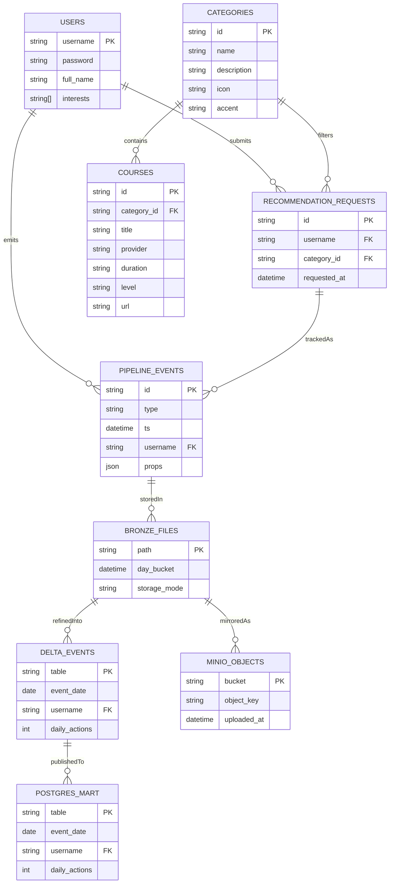

# GrowIt Pipeline ERD

GrowIt의 FastAPI, Airflow, Spark, Delta, Postgres, 그리고 MinIO를 아우르는 핵심 데이터 모델을 아래 ERD로 정리했습니다. 프런트엔드가 FastAPI에 남기는 이벤트가 어떤 형태로 저장되고 가공되는지 한눈에 파악할 수 있습니다.



## 모델 설명 및 활용 팁

- **USERS / CATEGORIES / COURSES**: FastAPI가 관리하는 기초 메타데이터입니다. `users.json`과 코드 안의 `CATEGORY_BLUEPRINTS`를 원천으로 삼습니다.
- **RECOMMENDATION_REQUESTS**: UI가 `/api/recommendations`에 보낸 요청을 개념적으로 표현한 테이블입니다. Airflow나 Spark에서 최근 요청 이력을 파악할 때 참고합니다.
- **PIPELINE_EVENTS**: 로그인·추천 등 모든 사용자 행위를 JSONL로 남긴 실시간 로그입니다. `/data/bronze/app/YYYY/MM/DD/part-*.jsonl` 경로에 append 되며, 필요시 MinIO `logs` 버킷에도 동일하게 업로드됩니다.
- **Custom Events**: `/api/events`로 전송되는 검색어 입력(`search_query`), 추천 버튼 클릭(`category_recommendation`), 인기 유튜브 영상 시청(`video_open`) 등 UI 이벤트가 `PIPELINE_EVENTS.props`에 JSON으로 저장되므로, 사용자 행동을 훨씬 세밀하게 분석할 수 있습니다.
- **BRONZE_FILES / DELTA_EVENTS / POSTGRES_MART**: Airflow가 Spark 작업을 호출하면서 Bronze → Delta → Postgres 순서로 정제하는 단계를 나타냅니다. Delta 레이어는 장기 보관, Postgres는 Zeppelin/BI 접근을 위한 골드 마트입니다.
- **MINIO_OBJECTS**: `USE_MINIO=true`일 때의 업로드 이력을 간단히 나타낸 뷰입니다. 객체 키는 `bronze/app/<날짜>/part-*.jsonl` 패턴으로 구성됩니다.

이 구조를 기반으로 매일 수집된 이벤트를 사용자, 카테고리, 관심사별로 집계하면 추천 품질과 학습자 행동을 쉽게 분석할 수 있습니다.

## 주요 쿼리 예시

`mart.daily_events`는 Spark ETL이 최종적으로 적재하는 Postgres 마트 테이블입니다. 아래 SQL을 통해 가장 흔하게 확인하는 지표를 바로 조회할 수 있습니다.

```sql
-- 1) 최근 7일 일자별 총 이벤트 수
SELECT event_date, SUM(cnt) AS total_events
FROM mart.daily_events
WHERE event_date >= CURRENT_DATE - INTERVAL '7 days'
GROUP BY event_date
ORDER BY event_date;

-- 2) 최근 30일 동안 이벤트가 많은 상위 5명의 사용자
SELECT user_id, SUM(cnt) AS events_last_30d
FROM mart.daily_events
WHERE event_date >= CURRENT_DATE - INTERVAL '30 days'
GROUP BY user_id
ORDER BY events_last_30d DESC
LIMIT 5;

-- 3) Delta 로그를 조인해 카테고리 정보까지 한 번에 보는 예시
-- (Zeppelin이나 Spark SQL에서 실행하면 편리합니다.)
SELECT d.event_date,
       d.user_id,
       d.cnt,
       b.props ->> 'category' AS category_slug
FROM mart.daily_events d
LEFT JOIN delta.`/data/delta/events` b
  ON d.user_id = b.user_id
 AND DATE(b.ts) = d.event_date
WHERE d.event_date = CURRENT_DATE - INTERVAL '1 day'
ORDER BY d.cnt DESC;
```

- **1번 쿼리**: 매일 이벤트 적재가 정상인지 빠르게 체크할 때 사용합니다.
- **2번 쿼리**: 이벤트가 많은 파워 유저를 찾거나 사용자 샘플을 뽑을 때 유용합니다.
- **3번 쿼리**: Delta 로그(`b.props`)에 포함된 카테고리·추가 속성을 함께 조회해 분석 범위를 확장합니다.

필요에 따라 `mart.daily_events`를 BI 도구나 노트북에 연결하면 사용자·카테고리·일자 단위 대시보드를 쉽게 만들 수 있습니다.
