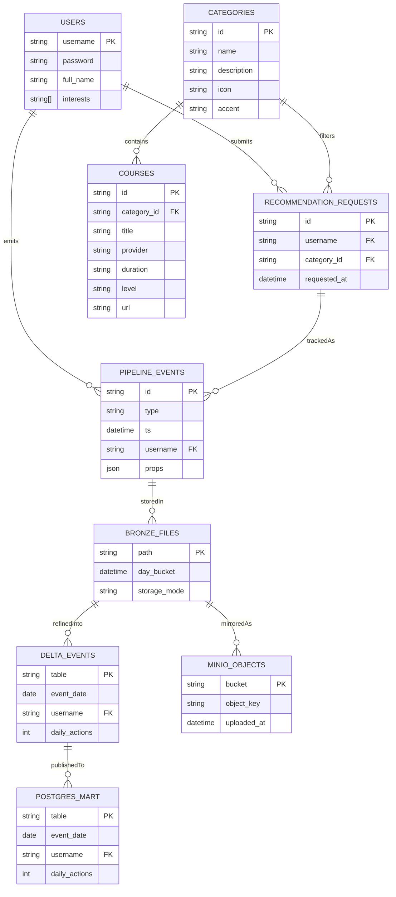

# GrowIt Pipeline ERD

## 현재 수집 중인 웹 이벤트
- 모든 이벤트는 `POST /api/events`(직접 호출) 또는 API 사이드이펙트로 기록되며, `user_id`(없으면 anonymous)와 `_server.ip`/`_server.ua`가 공통으로 붙습니다.
- 주요 이벤트와 props:

| event_type | 트리거 위치 | props 예시 |
| --- | --- | --- |
| login | `/api/login` 성공 시 백엔드에서 자동 기록 | `{ interests: string[] }` |
| page_view | 라우트 진입/변경(전역 GlobalAnalytics) | `{ path, search? }` |
| ui_click | 모든 클릭(전역, `data-track-name`으로 세분화 가능) | `{ path, tag, text?, track_name? }` |
| ui_change | 인풋 변경(전역) | `{ path, field, tag, input_type }` |
| home_category_click | 홈 화면 카테고리 카드 클릭 | `{ categoryId }` |
| category_select | `/categories`에서 카드 선택 | `{ categoryId }` |
| category_recommendation | ① `/api/recommendations` 요청을 FastAPI가 처리할 때 `{ category, course_count }` ② 추천 수신 후 UI에서 `{ categoryId, videoCount }` | 참고: 동일 type으로 두 경로에서 수집 |
| video_open | 유튜브 카드 클릭(홈 인기, 카테고리 추천, 검색 결과) | `{ videoId, source, categoryId?, query? }` |
| search_query | 검색어 입력 후 600ms 유지 | `{ query }` |
| search_keyword_click | 인기 검색어 배지 클릭 | `{ keyword }` |

- 추가로 넣으면 좋은 이벤트 아이디어
  - `login_fail`/`auth_error`: 잘못된 자격 증명 시도 파악.
  - `recommendation_error`: 추천 API 실패 원인 별 집계.
  - `video_complete`/`watch_progress`: 학습 콘텐츠 실제 소비 여부 추적.
  - `cta_click`: 배너, 상단 CTA 버튼 등 퍼널 진입점 클릭률 측정.

GrowIt의 FastAPI, Airflow, Spark, Delta, Postgres, 그리고 MinIO를 아우르는 핵심 데이터 모델을 아래 ERD로 정리했습니다. 프런트엔드가 FastAPI에 남기는 이벤트가 어떤 형태로 저장되고 가공되는지 한눈에 파악할 수 있습니다.


```mermaid
erDiagram
    USERS ||--o{ PIPELINE_EVENTS : emits
    USERS ||--o{ RECOMMENDATION_REQUESTS : submits
    CATEGORIES ||--o{ COURSES : contains
    CATEGORIES ||--o{ RECOMMENDATION_REQUESTS : filters
    RECOMMENDATION_REQUESTS ||--o{ PIPELINE_EVENTS : trackedAs
    PIPELINE_EVENTS ||--o{ BRONZE_FILES : storedIn
    BRONZE_FILES ||--o{ DELTA_EVENTS : refinedInto
    DELTA_EVENTS ||--o{ POSTGRES_MART : publishedTo
    BRONZE_FILES ||--o{ MINIO_OBJECTS : mirroredAs

    USERS {
        string username PK
        string password
        string full_name
        string[] interests
    }

    CATEGORIES {
        string id PK
        string name
        string description
        string icon
        string accent
    }

    COURSES {
        string id PK
        string category_id FK
        string title
        string provider
        string duration
        string level
        string url
    }

    RECOMMENDATION_REQUESTS {
        string id PK
        string username FK
        string category_id FK
        datetime requested_at
    }

    PIPELINE_EVENTS {
        string id PK
        string type
        datetime ts
        string username FK
        json props
    }

    BRONZE_FILES {
        string path PK
        datetime day_bucket
        string storage_mode
    }

    DELTA_EVENTS {
        string table PK
        date event_date
        string username FK
        int daily_actions
    }

    POSTGRES_MART {
        string table PK
        date event_date
        string username FK
        int daily_actions
    }

    MINIO_OBJECTS {
        string bucket PK
        string object_key
        datetime uploaded_at
    }
```

## 모델 설명 및 활용 팁

- **USERS / CATEGORIES / COURSES**: FastAPI가 관리하는 기초 메타데이터입니다. `users.json`과 코드 안의 `CATEGORY_BLUEPRINTS`를 원천으로 삼습니다.
- **RECOMMENDATION_REQUESTS**: UI가 `/api/recommendations`에 보낸 요청을 개념적으로 표현한 테이블입니다. Airflow나 Spark에서 최근 요청 이력을 파악할 때 참고합니다.
- **PIPELINE_EVENTS**: 로그인·추천 등 모든 사용자 행위를 JSONL로 남긴 실시간 로그입니다. `/data/bronze/app/YYYY/MM/DD/part-*.jsonl` 경로에 append 되며, 필요시 MinIO `logs` 버킷에도 동일하게 업로드됩니다.
- **Custom Events**: `/api/events`로 전송되는 검색어 입력(`search_query`), 추천 버튼 클릭(`category_recommendation`), 인기 유튜브 영상 시청(`video_open`) 등 UI 이벤트가 `PIPELINE_EVENTS.props`에 JSON으로 저장되므로, 사용자 행동을 훨씬 세밀하게 분석할 수 있습니다.
- **BRONZE_FILES / DELTA_EVENTS / POSTGRES_MART**: Airflow가 Spark 작업을 호출하면서 Bronze → Delta → Postgres 순서로 정제하는 단계를 나타냅니다. Delta 레이어는 장기 보관, Postgres는 Zeppelin/BI 접근을 위한 골드 마트입니다.
- **MINIO_OBJECTS**: `USE_MINIO=true`일 때의 업로드 이력을 간단히 나타낸 뷰입니다. 객체 키는 `bronze/app/<날짜>/part-*.jsonl` 패턴으로 구성됩니다.

이 구조를 기반으로 매일 수집된 이벤트를 사용자, 카테고리, 관심사별로 집계하면 추천 품질과 학습자 행동을 쉽게 분석할 수 있습니다.

## 주요 쿼리 예시

Spark ETL은 `mart.events`(상세)와 `mart.daily_events`(일별 요약)를 Postgres에 적재합니다. 아래 SQL로 운영/분석을 빠르게 확인할 수 있습니다.

```sql
-- (운영 체크) 최신 이벤트가 잘 쌓였는지
SELECT COUNT(*) AS rows, MAX(ts) AS latest_ts, MAX(event_date) AS latest_date
FROM mart.events;

-- (최근 7일) 일자별 총 이벤트 수
SELECT event_date, COUNT(*) AS total_events
FROM mart.events
WHERE event_date >= CURRENT_DATE - INTERVAL '7 days'
GROUP BY event_date
ORDER BY event_date;

-- (상위 유저) 최근 30일 이벤트가 많은 사용자
SELECT username, COUNT(*) AS events_last_30d
FROM mart.events
WHERE event_date >= CURRENT_DATE - INTERVAL '30 days'
GROUP BY username
ORDER BY events_last_30d DESC
LIMIT 10;

-- (퍼널 예시) 추천 버튼 클릭 → 실제 추천 결과 확인 흐름
WITH click AS (
  SELECT username, ts
  FROM mart.events
  WHERE type = 'category_recommendation'
),
view AS (
  SELECT username, ts
  FROM mart.events
  WHERE type = 'ui_click' AND props ->> 'path' = '/admin'
)
SELECT COUNT(*)                            AS clicks,
       COUNT(view.username)                AS admin_views,
       100.0 * COUNT(view.username) / NULLIF(COUNT(*),0) AS view_rate_pct
FROM click
LEFT JOIN view
  ON click.username = view.username
 AND view.ts BETWEEN click.ts AND click.ts + INTERVAL '10 minutes';

-- (Delta 직접) 최신 20건 RAW 확인
SELECT * FROM delta.`/data/delta/events`
ORDER BY ts DESC LIMIT 20;

-- (카테고리 TOP) 추천 요청에서 가장 많이 선택한 카테고리
SELECT props ->> 'categoryId' AS category_id,
       COUNT(*) AS cnt
FROM mart.events
WHERE type = 'category_recommendation'
GROUP BY category_id
ORDER BY cnt DESC
LIMIT 10;

-- (UI 컴포넌트 TOP) 클릭 로그 기준 가장 많이 눌린 경로/컴포넌트
SELECT COALESCE(props ->> 'path', props ->> 'tag', 'unknown') AS component,
       COUNT(*) AS clicks
FROM mart.events
WHERE type = 'ui_click'
GROUP BY component
ORDER BY clicks DESC
LIMIT 10;
```

- 운영 체크: 최신 `ts`, `event_date`가 갱신되는지.
- 활동 상위 유저: 최근 30일 집계.
- 퍼널: 추천 버튼 → Admin 화면 확인률.
- 카테고리/컴포넌트 TOP: `category_recommendation`, `ui_click` 이벤트 속성에서 집계.
- Delta RAW: `/data/delta/events`를 직접 확인해 스키마/값을 검증.

필요에 따라 `mart.daily_events`를 BI 도구나 노트북에 연결하면 사용자·카테고리·일자 단위 대시보드를 쉽게 만들 수 있습니다.
