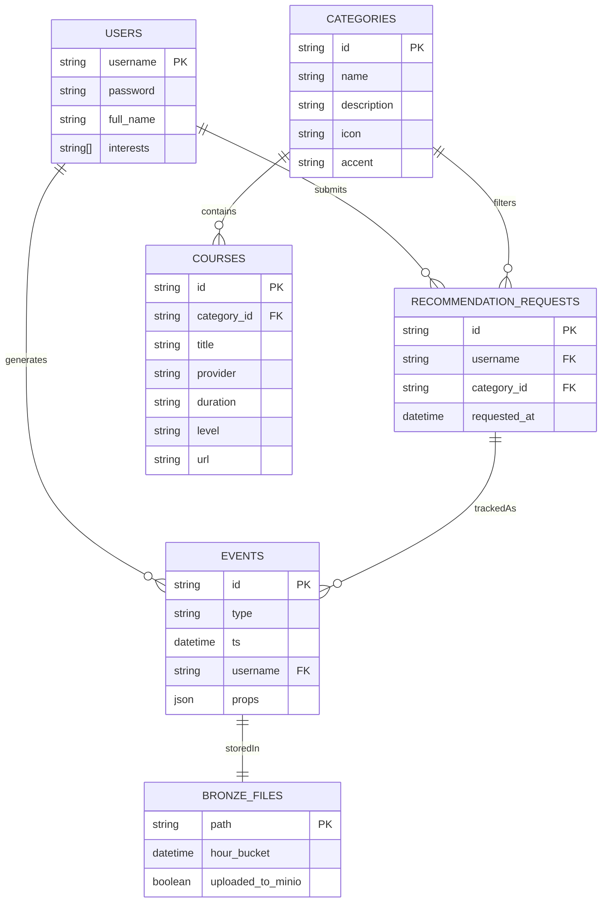

# Learning Pipeline ERD

아래 ERD는 웹 앱이 다루는 핵심 레코드(사용자, 카테고리, 강의, 이벤트)를 정리한 것입니다.

## 테이블 설명

- **USERS**: `users.json`에서 로드되는 계정 정보. 로그인 시 검증되고 관심사를 `props`로 기록합니다.
- **CATEGORIES**: FastAPI가 제공하는 10개 트랙 메타데이터(아이콘, 강조 컬러 포함).
- **COURSES**: 각 카테고리당 100개의 가상 강의 URL을 가진 항목. UI 카드에서 바로가기 링크를 노출합니다.
- **RECOMMENDATION_REQUESTS**: 사용자가 선택한 카테고리 요청을 개념적으로 캡처한 뷰로, API 페이로드와 동일한 구조입니다.
- **EVENTS**: 로그인/추천 액션을 JSONL로 남기는 로그. 사용자, 이벤트 유형, 요청 메타데이터를 모두 저장합니다.
- **BRONZE_FILES**: `/data/bronze/app/YYYY/MM/DD/part-*.jsonl` 경로에 쌓이는 파일과 선택적으로 MinIO에 업로드되는 위치를 추상화했습니다.

이 모델을 기준으로 Delta Lake나 Postgres에 적재하면 사용자별 행동 히스토리와 카테고리별 강의 소비 현황을 쉽게 분석할 수 있습니다.
